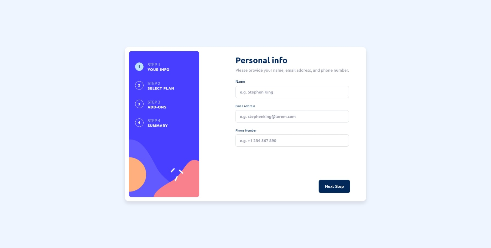

# Frontend Mentor - Multi-step form solution

This is a solution to the [Multi-step form challenge on Frontend Mentor](https://www.frontendmentor.io/challenges/multistep-form-YVAnSdqQBJ). Frontend Mentor challenges help you improve your coding skills by building realistic projects.

## Overview

### The challenge

Users should be able to:

- Complete each step of the sequence
- Go back to a previous step to update their selections
- See a summary of their selections on the final step and confirm their order
- View the optimal layout for the interface depending on their device's screen size
- See hover and focus states for all interactive elements on the page
- Receive form validation messages if:
  - A field has been missed
  - The email address is not formatted correctly
  - A step is submitted, but no selection has been made

### Links

- Solution URL: [https://github.com/nikosetiawanp/multi-step-form](https://your-solution-url.com)
- Live Site URL: [https://nikosetiawanp.github.io/multi-step-form/](https://nikosetiawanp.github.io/multi-step-form/)

## My process

### Built with

### What I learned

- How to implement Zod into React Hook Form
- Passing React Hook objects as props
- How to build multi step form

#### 🚧 Challenges & Solutions

##### Integrating Zod into React Hook Form

Integrating Zod into React Hook form was tricky, because React Hook Form official docs only shows integration with yup. It took several tries to do it perfectly. Nothing major, could be resolved by reading the docs carefully. For those interested, you can visit [https://nikosetiawanp.hashnode.dev/how-to-integrate-zod-into-react-hook-form](https://nikosetiawanp.hashnode.dev/how-to-integrate-zod-into-react-hook-form) on how I did it.

##### Tailwind Responsive Text

For some reason, Tailwind v4 doesn't let me override a custom class at different breakpoints. Specifically, this doesn't work: `text-preset-5 md:text-preset-4`. Tailwind refuses to apply the `text-preset-4` styles at the md breakpoint and above.

As a workaround, I had to manually apply the styles using something like `md:text-[14px]` to increase the text size on tablet screens.

### Continued development

Currently, no plan for continued development, as this is a one-and-done challenge.

### Useful resources

- [https://react-hook-form.com/get-started](https://react-hook-form.com/get-started) - This helped me impelmenting react hook form into my form personal info form.
- [https://zod.dev/api](https://zod.dev/api) - This helped me create schemas for my form, and integrate zod with react hook form.

## Author

- Website - [Niko Setiawan P.](https://github.com/nikosetiawanp/)
- Frontend Mentor - [@yourusername](https://www.frontendmentor.io/profile/nikosetiawanp)
